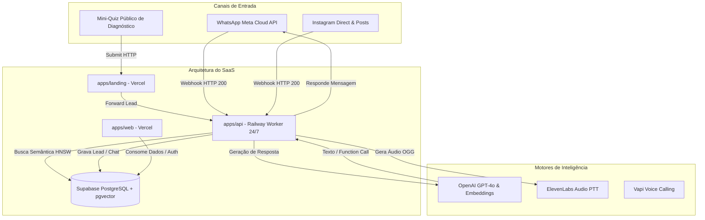
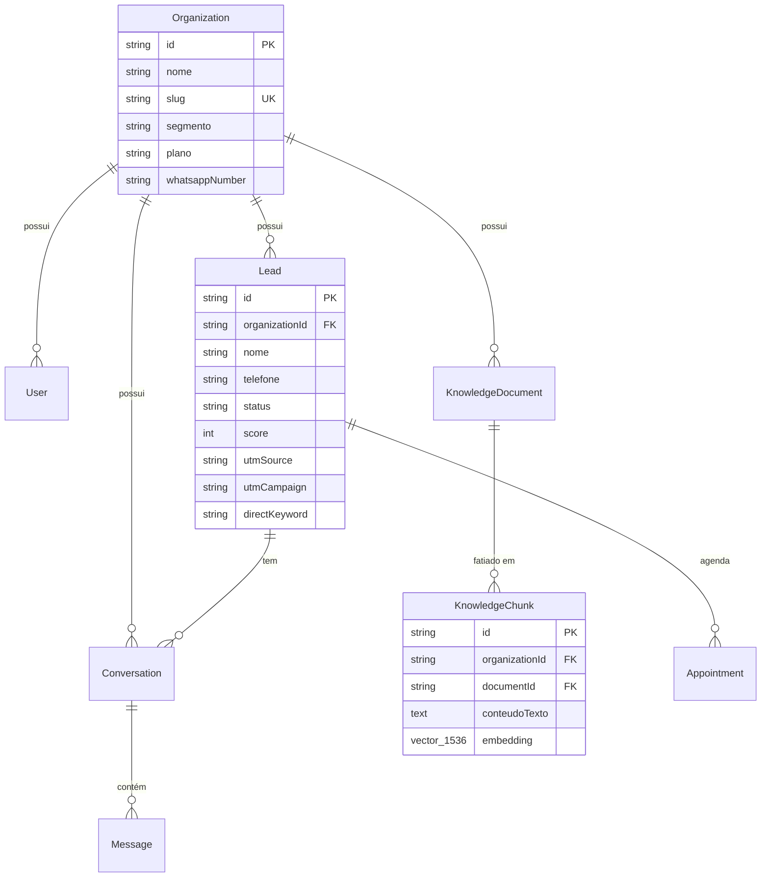

# 🏛️ ARCHITECTURE.md — Arquitetura Canônica do OmniSDR

---

## 1. Visão Geral da Topologia Monorepo

```text
21-mai-sdrai/
├── apps/
│   ├── landing/                  ← (Vercel $0) Site Institucional + Quiz (/quiz/[slug])
│   ├── web/                      ← (Vercel $0) Painel B2B (Next.js SSR + Supabase Auth)
│   └── api/                      ← (Railway ~$5) Servidor Express 24/7 de Webhooks e IA
├── packages/
│   └── database/                 ← Prisma Schema, Migrations Supabase & pgvector
└── docs/                         ← Documentação técnica complementar
```

---

## 2. Diagrama de Fluxo de Dados e Automação



---

## 3. Esquema de Entidades no Supabase PostgreSQL



---

## 4. Lógica de Autenticação e Segurança
1. **Frontend (Next.js):** Utiliza `@supabase/ssr` para gerenciar tokens JWT através de cookies seguros `httpOnly`.
2. **Middleware:** A rota `/dashboard/*` verifica a existência do usuário logado antes de qualquer renderização visual.
3. **Multi-Tenancy:** Cada consulta ao banco obrigatoriamente aplica o filtro `organizationId`, assegurando isolamento rigoroso entre clientes B2B.
