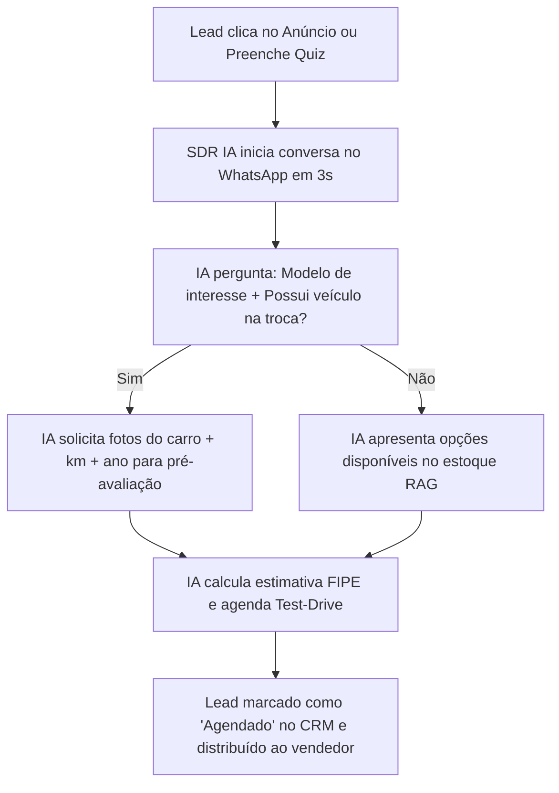
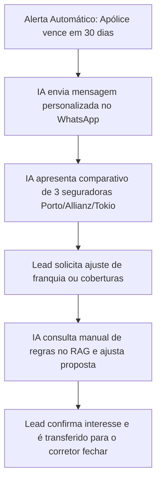
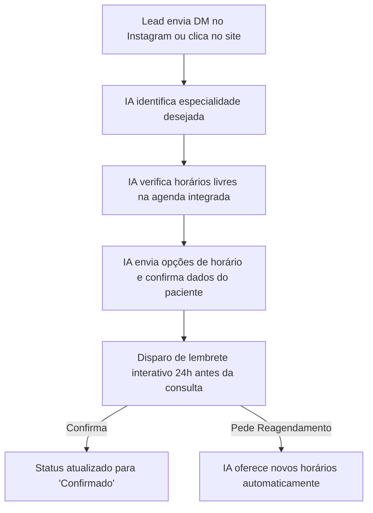

# 📄 PRD (Product Requirement Document) — OmniSDR B2B

---

## 1. Visão Geral do Produto
O **OmniSDR** é uma plataforma SaaS B2B de automação comercial e pré-vendas orientada por Inteligência Artificial. Seu propósito é eliminar o tempo ocioso no atendimento inicial, respondendo leads em menos de 5 segundos, qualificando o interesse do comprador e agendando reuniões diretamente no calendário dos vendedores humanos.

---

## 2. Personas e Públicos-Alvo

### Persona 1: Cliente B2B (Comprador do SaaS)
* **Perfil:** Donos de empresas, diretores comerciais e gestores de marketing de empresas de serviços (Corretoras de Seguros, Clínicas, Concessionárias, Escritórios Contábeis).
* **Dores:** Perda de leads por demora no atendimento no WhatsApp, alto custo com SDRs humanos em horários noturnos e falta de visibilidade do ROI de anúncios no Meta Ads.
* **Objetivo:** Aumentar a taxa de agendamento e qualificar leads 24/7 com custo previsível.

### Persona 2: Lead (Usuário Final Atendido)
* **Perfil:** Consumidor que clica em um anúncio no Instagram ou envia mensagem no WhatsApp buscando uma cotação, avaliação de veículo ou agendamento de consulta.
* **Expectativa:** Resposta imediata, sem menus numéricos cansativos, com linguagem humanizada e resolução rápida de dúvidas.

---

## 3. Jornadas e Fluxos de Atendimento por Vertical

### 🚗 Fluxo 1: Concessionária & Troca de Veículos

### 🛡️ Fluxo 2: Corretora de Seguros & Radar de Renovações

### 🏥 Fluxo 3: Clínicas Médicas & Redução de No-Show

---

## 4. Requisitos Funcionais

1. **Atendimento Multicanal:** Suporte a WhatsApp (Meta Cloud API e QR Code), Instagram Direct e Voice Calling.
2. **Base de Conhecimento Dinâmica (RAG):** Capacidade do cliente B2B enviar documentos (PDFs, planilhas, manuais) que delimitam as respostas da IA.
3. **Atribuição de Marketing:** Registro automático de `utm_source`, `utm_campaign`, `utm_medium` e `directKeyword` em cada lead.
4. **Rodízio Inteligente (Round-Robin):** Distribuição equitativa de leads qualificados entre os corretores/vendedores da equipe.
5. **Inbox com Intervenção Humana:** Possibilidade de um operador assumir o chat a qualquer momento, pausando o agente de IA para aquele lead específico.

---

## 5. Métricas de Sucesso (KPIs)
* **Tempo Médio de Primeira Resposta (FRT):** < 5 segundos.
* **Taxa de Qualificação Automática:** > 65% dos leads respondem às 3 perguntas chave de qualificação.
* **Redução de No-Show:** Diminuição de pelo menos 30% em faltas de consultas/test-drives com lembretes automáticos.
