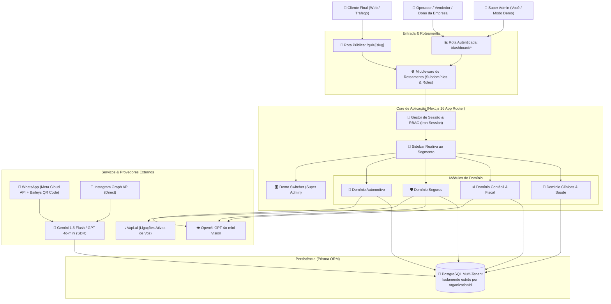

# 🏛️ Arquitetura Técnica & Fluxo de Dados: Omni Service SaaS

---

## 1. Visão Arquitetural Macro

O **Omni Service SaaS** foi projetado seguindo o padrão de **Monolito Modular Moderno Multi-Tenant**, permitindo alta velocidade de desenvolvimento, facilidade de deploy e custo de infraestrutura reduzido sem abrir mão de isolamento estrito entre empresas.



---

## 2. Ciclo de Vida do Lead & Torre de Atribuição

O ciclo completo de um lead, desde o primeiro toque no anúncio até o fechamento com receita atribuída:

```
[1. Lead Clica no Anúncio]
      │
      ├── Opção A: Clica no Mini-Quiz (Web) ➔ Responde 3 perguntas ➔ Salva respostas ➔ Abre WhatsApp
      ├── Opção B: Clica em Anúncio Click-to-WhatsApp ➔ Inicia conversa direta
      └── Opção C: Manda Direct no Instagram (Palavra-chave: ex: "QUERO")
      │
      ▼
[2. Ingestão & Deduplicação SHA-256]
      - Normaliza telefone no padrão internacional E.164 (+5511999998888)
      - Gera hash SHA-256 para evitar duplicidade de disparos
      - Grava parâmetros de UTM (source, campaign, ad_id)
      │
      ▼
[3. Atendimento Imediato com SDR IA (< 2 segundos)]
      - Simula presença 'Gravando áudio...' (PTT) por 3 segundos
      - Dispara áudio ou texto com contexto pré-carregado do Quiz
      - Se lead enviar foto (carro, CNH, receita) ➔ Motor de Visão processa em 1.5s
      │
      ▼
[4. Qualificação Automática (Score 0 a 100)]
      - A IA avalia intenção de compra, prazo e perfil
      - Adiciona justificativa explicativa na Ficha 360° do Lead
      │
      ▼
[5. Handoff & Agendamento]
      - Agenda reunião / test-drive / consulta médica
      - Transfere o lead quente para o vendedor humano com histórico completo
      │
      ▼
[6. Venda Concluída & Atribuição de ROI]
      - Vendedor marca deal como 'GANHO' e insere o valor em R$
      - Dashboard credita a receita ao anúncio e canal de origem exatos
```

---

## 3. Modelo de Entidades Multi-Segmento

As tabelas do Prisma foram estruturadas para suportar todos os segmentos sem tabelas redundantes:

* **`Organization`**: Armazena a conta da empresa, o `segmento` contratado (`AUTO`, `INSURANCE`, `ACCOUNTING`, `CLINIC`, `GENERAL`) e configurações de IA/canais.
* **`User`**: Operadores e administradores da empresa, com perfis (`SUPER_ADMIN`, `ADMIN_EMPRESA`, `VENDEDOR`).
* **`Lead`**: Entidade central de contato com dados cadastrais, score da IA, atribuição de UTMs e respostas de quiz.
* **`Conversation` & `Message`**: Histórico em tempo real de mensagens de WhatsApp, Instagram e simuladores de áudio.
* **Tabelas de Extensão Vertical**:
  * `Vehicle`: Catálogo de pátio automotivo com fotos, placa, quilometragem e valor.
  * `InsurancePolicy`: Apólices de clientes com vigência, seguradora e régua de renovação.
  * `TaxGuide`: Guias fiscais com linha digitável, código PIX e status de pagamento.
  * `Appointment`: Compromissos marcados (visitas, reuniões, consultas) com controle de status e no-show.
